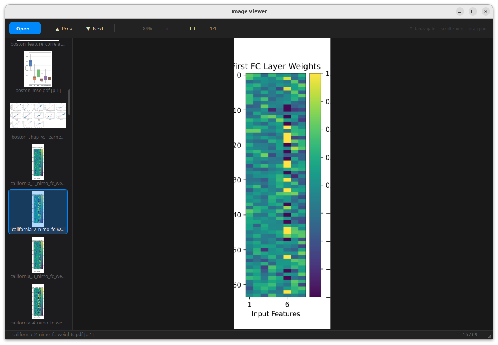

# Image Viewer



A local desktop image viewer built with PyQt6. Designed for inspecting sequences of same-sized images or PDF pages side-by-side at a consistent zoom level.

## Features

- Load multiple images or PDFs in one go
- Thumbnail sidebar — click any item to jump to it
- Keyboard navigation preserves zoom, so consecutive frames stay visually aligned
- Smooth zoom anchored under the mouse cursor
- Pan by dragging; fit-to-window or 1:1 zoom shortcuts
- PDF pages are rendered at 150 DPI and treated as regular images in the sequence
- Dark theme throughout

## Requirements

- Python 3.10+
- [PyQt6](https://pypi.org/project/PyQt6/)
- [PyMuPDF](https://pypi.org/project/PyMuPDF/) (`fitz`) — PDF rendering

Install dependencies:

```bash
pip install PyQt6 pymupdf
```

## Usage

```bash
python main.py
```

Click **Open…** (or `Ctrl+O`) to load images or PDFs. Multiple files can be selected at once.

## Keyboard Shortcuts

| Key | Action |
|-----|--------|
| `↑` | Previous image |
| `↓` | Next image |
| `+` / `=` | Zoom in |
| `-` | Zoom out |
| Scroll wheel | Zoom under cursor |
| `F` | Fit to window |
| `1` | 1:1 zoom |
| `Ctrl+O` | Open files |
| Drag | Pan |

## Supported Formats

Images: PNG, JPEG, BMP, GIF, TIFF, WebP  
Documents: PDF (each page becomes one entry in the sequence)

## Project Structure

```
image_viewer/
├── main.py                   # Entry point
└── app/
    ├── style.py              # QSS stylesheet and dark palette
    ├── loaders/
    │   ├── image_loader.py   # Raster image loading
    │   └── pdf_loader.py     # PDF rendering + path label helpers
    ├── widgets/
    │   ├── image_view.py     # Zoomable QGraphicsView
    │   └── sidebar.py        # Thumbnail filmstrip (QListWidget)
    └── windows/
        └── main_window.py    # Top-level QMainWindow, orchestrates state
```
